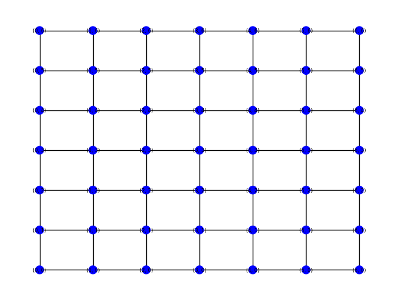
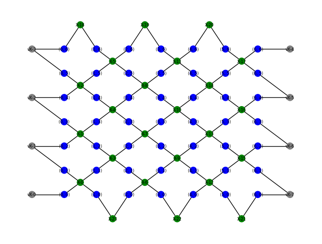
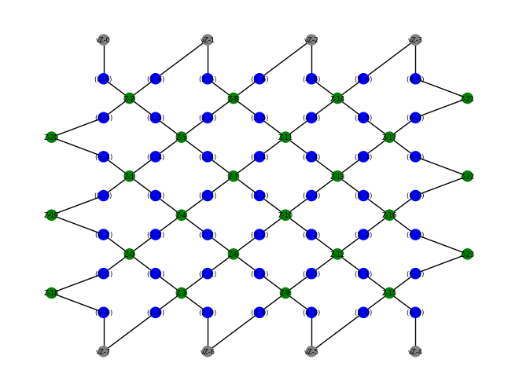

# **SurfaceQ**: a Python package designed for running experiments with Kitaev surface codes

This repository contains a Qiskit implementation of Kitaev surface codes, a topological quantum CSS code family based on planar lattices. It shares much in common with the toric code, but the surface code is more general, flexible and its planar arrangement is easier to implement in practise. A Qiskit implementation of the toric code can be found [here]( https://github.com/elhyc/Kitaev-Toric-Code ).


## Features:

The SurfaceQ package implements the <em>rotated</em> variant of the surface code. The rotated geometry is more efficient with respect to the number of required qubits, while maintaining the the same code distance as the unrotated version. In particular, the total required qubits for the rotated surface code is about half the total required qubits for the unrotated code. For reference, the required number of qubits is as follows:


|      | Data qubits | Ancilla qubits|  Code distance |
 -------- |----------| -------        |   -------  | 
Unrotated |   $2d^2 - 2d + 1  $       |   $2d^{2} - 2d$      | $d$       
Rotated   | $d^{2}$        | $d^{2} - 1$ |  $d$               
   |      |               
                

Currently, the SurfaceQ package can simulate quantum error correction procedures for both <em>depolarizing </em> and <em> erasure noise</em>. When simulating depolarizing noise, the user has the option to select between the minimum-weight perfect matching (MWPM) decoder or the union-find (UF) decoder. 

<!-- 
## Overview


The basic premise of the planar surface code is similar to the idea behind the toric code -- [please see the description here for details](https://github.com/elhyc/Kitaev-Toric-Code). Qubits are placed on the edges of a $k_{0} \times k_{1}$ lattice grid, but unlike the toric code the lattice boundary is not considered to be periodic, so that one works with a planar lattice instead (so that the lattice topologically represents a contractible disc with boundary). Below is a figure of such a planar $5 \times 5$ lattice:


<p align="center">

</p>


The planar lattices have two kinds of boundary edges: edges that make up the "smooth boundary" and edges that make up the "rough boundary". In the example above, the edges making up the "smooth boundary" are the edges $(0,6), (6,12), (12,18), (18,24), (24,30)$;
$(5,11), (11,17), (17,23), (23,29), (29,35)$. The edges that make up the "rough boundary" are the edges $(0,-6), (1,-5), (2,-4), (3,-3), (4,-2), (5,-1)$ ; $(35,41), (34,40), (33,39), (32,38), (31,37), (30,36)$. 

The qubits on the "smooth boundary" edges belong to a single plaquette (and two stars), while the qubits on the "rough boundary" edges belong to a single star (and two plaquettes).
In the case of the toric code, each edge of the lattice belongs to two plaquettes and two stars -- therefore, a $X$ or $Z$ flip on a qubit (on any edge) will always be detected by syndrome measurements for pairs of plaquette or star operators. In the planar case with boundary, a $X$ or $Z$ flip on a qubit belonging to a boundary edge will only be detected by a syndrome measurement for a single plaquette or star in isolation.
 -->

## Implementation details

Apart from Qiskit, the [main code](./src/rotated_surface_code.py) uses [NetworkX](https://networkx.org/) to implement the necessary data structures required for (rotated) surface codes. 
Unlike the implementation found [here](https://github.com/elhyc/Kitaev-Toric-Code), this implementation uses more general algorithms available for CSS codes to: 1) produce logical states, 2) construct plaquette and star operators.

First, a NetworkX lattice grid of an appropriate size is formed -- we initiate a NetworkX lattice grid of size $d \times d$  is formed. This lattice is referred to as the <em>primal lattice</em> of the surface code. We can use NetworkX to produce a visualization of it:

<p align="center">

</p>


Once we have our parity check matrices $(H_{X}, H_{Z})$, we can define corresponding *Tanner graphs*: these are bipartite graphs where a "check node" is defined for each row of $H = H_{X}, H_{Z}$ and edges are formed between the check node and nodes corresponding to the edges of the lattice according to the non-zero entries of the given row in $H$. Below are examples for the $X$-type and $Z$-type Tanner graphs respectively for the $5 \times 5$ lattice: 

<p align="center">


</p>

The check nodes on the Tanner graphs (supporting the ancilla qubits) are colored green, while the data nodes (supporting the data qubits) are colored blue. Furthermore, there are <em>virtual</em> check nodes labelled with the prefix of ```v-```; these nodes on the Tanner graphs do not correspond to any physical ancilla qubit. 

This [Jupyter notebook](./src/KitaevSurfaceCode.ipynb) demonstrates some of the functionality provided by the main python file in this repository.


## Simulating surface codes and approximating code thresholds

A useful aspect of the implementation of the surface code based on rotated surfaces is the relatively minimal number of qubits required to define the system. This allows one to run local simulations for many code distances at reasonable runtimes. In turn, this allows one to approximate code thresholds of the rotated surface code for depolarizing noise (under either the MWPM decoder or UF decoder), and erasure noise (under the peeling decoder). Assuming an idealized error model, where errors are only introduced after ground state initialization -- and measurements are perfect, we estimate that the respective code thresholds are: around 15% for the MWPM decoder, around 12% for the UF decoder, and around 50% for the peeling decoder (for erasure noise).  


<u>Depolarizing error (MWPM vs UF decoder)</u>:
<p align="center">
  
  
</p>


<u>Erasure error</u>:
<p align="center">
  
</p>

Note that while the code threshold for the MWPM decoder is slightly higher than the threshold for the UF decoder, an ideal implementation of the UF decoder should have [<em>almost-</em>linear time complexity](https://arxiv.org/abs/1709.06218). That is, the time complexity is in $O(\alpha(n)n)$ where $\alpha(n)$ may be considered to satisfy $\alpha(n) \leq 3$ for all practical purposes. When running UF decoder and the MWPM decoder simulations with our implementation, we do indeed notice that error correction cycle simulations with the UF decoder run quicker than simulations with the MWPM decoder. 

Furthermore, note that the erasure error model is quite different from depolarizing noise. In the erasure error model, i.i.d. Pauli errors are introduced, but only among a subset of "flagged qubits". That is, the decoder is provided the knowledge of where these Pauli errors may possibly occur. In this error model, we can use the peeling decoder and exhibit high code threshold (of 50%). 
